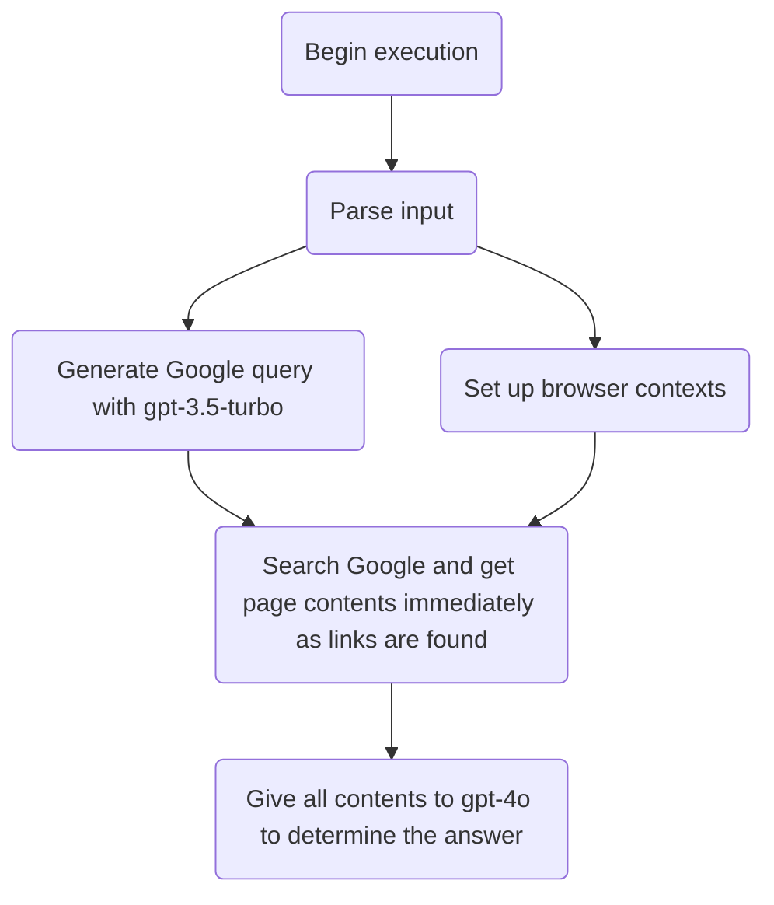

# browser-question

This tool answers a question provided to it by using the Chrome browser to search Google.

## Example

```bash
gptscript github.com/gptscript-ai/browser-question '{"question":"Who was Oliver Cromwell?"}'
```

## How it Works


